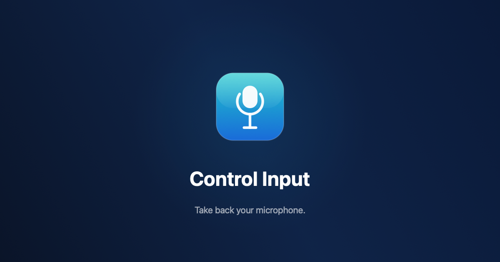
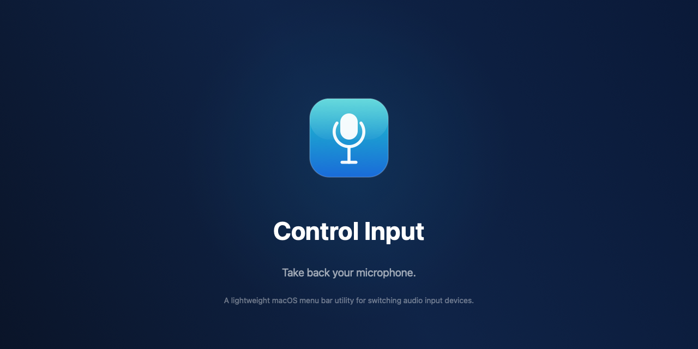

<p align="center">
  
</p>

<p align="center">
  <strong>native macOS menu bar control for audio input switching.</strong><br />
  built for the exact moment your AirPods Max decide they're in charge of your microphone.
</p>

<p align="center">
  <a href="#download">Download</a>
  ·
  <a href="#what-it-does">Features</a>
  ·
  <a href="#build-from-source">Build</a>
</p>

---

## the problem

you're on a call. AirPods Max are playing music in the background. macOS, without asking, switches your audio input to the AirPods mic. now you sound like you're talking through a tunnel. your colleagues are confused. you're digging through System Settings to fix something that shouldn't have broken.

this happens every single time.

## what it does

Control Input lives in your menu bar. one click to see every audio input on your system. one click to switch.

or set a preferred device and forget about it. Control Input automatically switches back whenever something tries to take over your mic.

no dock icon. no extra windows. just quiet, reliable control over something macOS should've handled from the start.

<p align="center">
  
</p>

## features

- **one-click switching** from the menu bar. built-in mic, Bluetooth headset, USB interface, whatever you've got connected
- **auto-switch** to your preferred device. when macOS silently changes your input (AirPods connecting, display plugging in), Control Input changes it right back
- **device-type icons** so you can tell built-in, Bluetooth, and external devices apart at a glance
- **theme support** with system, light, and dark modes that apply to the entire app
- **launch at login** so it's always there when you need it
- **no dock icon** because it should stay out of your way

---

## download

grab the latest build from the [releases page](../../releases). unzip, drag Control Input to your Applications folder, open it. done.

### if macOS blocks the app

the build isn't notarized yet, so macOS might flag it on first launch:

1. move `Control Input.app` to `/Applications`
2. try to open it, dismiss the warning
3. go to `System Settings > Privacy & Security`
4. scroll to the Security section, click `Open Anyway`
5. confirm and authenticate

this only needs to happen once.

## build from source

```bash
git clone https://github.com/emmagine79/control-input.git
cd control-input
open ControlInput.xcodeproj
```

build and run from Xcode. requires Xcode 15 or later.

## requirements

- macOS 14 Sonoma or later
- Apple Silicon or Intel

## built with

- SwiftUI, MenuBarExtra with `.window` style, `@Observable`
- CoreAudio for real-time device enumeration and switching
- ServiceManagement (SMAppService) for launch at login

## license

MIT. do whatever you want with it.
